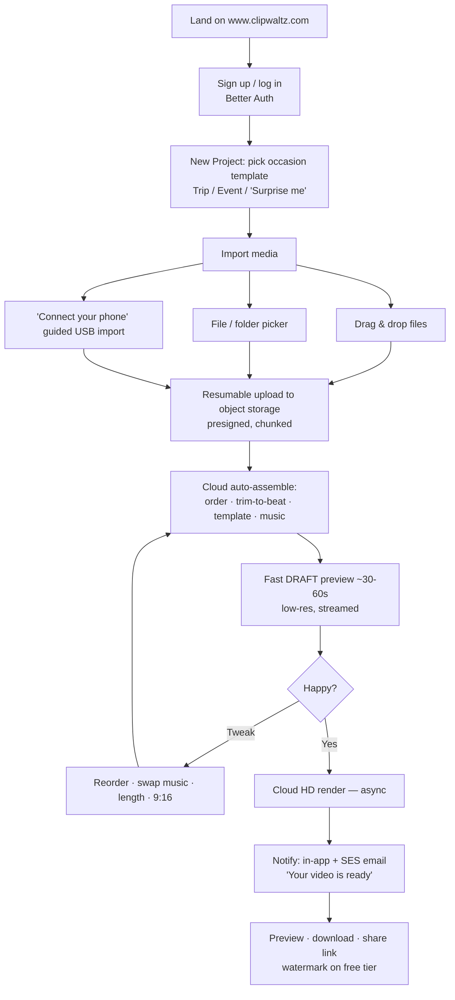
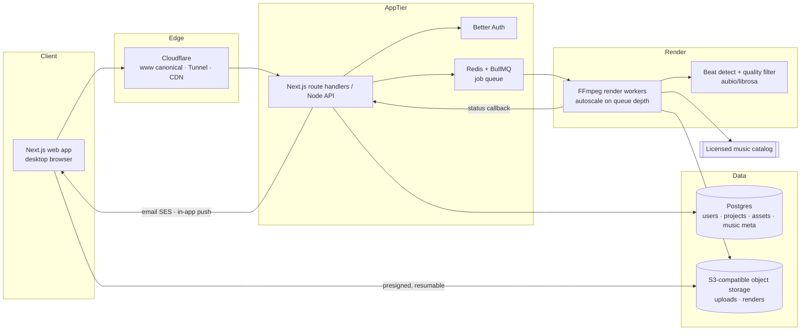
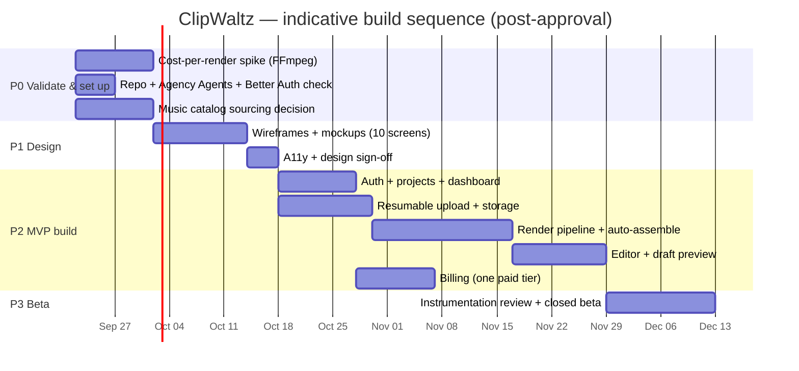

# ClipWaltz — Design & Build Plan

> **Turn the photos and videos on your phone into a polished, music-driven highlight
> video in under a minute — from your computer, no editing required.**
>
> **Status:** design & build plan — *for review and approval*. Successor to
> [`PRODUCT_PLAN.md`](PRODUCT_PLAN.md). Name **ClipWaltz** (clip + waltz — the
> music/rhythm angle); **`clipwaltz.com` purchased**. Canonical host
> `https://www.clipwaltz.com`, apex 308→www (standing rule).
>
> **All §7 decisions are now settled** (see [§7](#7-settled-decisions)) — this plan is ready
> for a go/no-go on the P0 workstreams.
>
> **Nothing is built yet.** This document defines *what* we design and build, in *what
> order*, and *which decisions still need your sign-off* before code starts.

---

## 0. What changed since the Product Plan (read this first)

The Product Plan assumed a **mobile-first** launch. You've redirected the MVP to a
**desktop web app first**, to prove the concept faster and cheaper. This plan is built
around that decision. Confirmed inputs from you:

| Decision | Your call | Effect on this plan |
|---|---|---|
| **MVP platform** | **Desktop web app** (Windows/Mac). Phone connects via USB to the PC; media is imported to the computer and/or uploaded to the web app for cloud processing. | No mobile app in MVP. No App Store/Play IAP tax. Uploads run in a desktop browser (far more reliable than mobile). Native mobile apps become a **later** phase. |
| **Beachhead** | **Consumer first (travel/events), real-estate fast-follow** | Build a *generic* template engine; ship 2 consumer templates first; RE templates drop in without re-architecting. |
| **Music** | **Licensed royalty-free catalog** (~10 cleared tracks for MVP) | "Safe to post" is a real feature. Catalog + per-track metadata (BPM/mood) is an MVP workstream. |

### The one honesty note that shapes the design

**A web browser cannot read a phone's photo library directly over USB.** Phones expose
photos over **MTP** (Android) or as a **camera/Image-Capture device** (iPhone) to the
*operating system*, not to web pages. WebUSB does not expose photo libraries, and there is
no cross-browser API that reads a connected phone's DCIM folder from a tab.

So "connect phone via USB" in the MVP is an **OS-assisted import**, and we'll say so in the
UI with a short guided flow:

1. User plugs the phone into the PC with USB.
2. The OS mounts it — Windows: *This PC → \[phone] → DCIM*; Mac: **Photos**/**Image
   Capture** for iPhone, **Android File Transfer** for Android.
3. In ClipWaltz the user picks those files via **drag-and-drop**, a **file picker**, or
   (Chrome/Edge) the **File System Access API** to select a whole folder at once.

This is honest, works on day one, and needs zero drivers. A future "ClipWaltz Desktop
Helper" (Electron/Tauri) *could* read MTP directly if the friction proves worth it — noted
as a later option, **not** MVP.

---

## 1. Design — the MVP experience

### 1.1 Reframed core flow (desktop web)

**UX principles (carried from Product Plan, re-anchored to web):**
- **Show the magic in ~30–60s** — a fast, low-res *draft* preview before the full render.
- **Uploads are the friction point** — resumable + chunked; show clear progress and let the
  user keep working. Desktop makes this dramatically easier than mobile.
- **Rendering is async** — never a blocking spinner; notify on completion.

### 1.2 Screen inventory (MVP)

| # | Screen | Purpose | Notes |
|---|---|---|---|
| 1 | **Marketing / landing** | Explain + convert | `www.` canonical, apex 308→www (standing rule) |
| 2 | **Auth** | Sign up / log in | Better Auth; email + one social provider |
| 3 | **Dashboard / Projects** | List projects, statuses, "New project" | Render status badges |
| 4 | **New Project wizard** | Occasion/template pick or "Surprise me" | 2 templates at MVP |
| 5 | **Import** | Drag-drop / picker / guided USB import | Progress, resume, thumbnails |
| 6 | **Draft Preview + Editor** | See the auto-cut; reorder, swap music, set length | 9:16 only at MVP |
| 7 | **Render status** | Async progress | Push in-app + email on done |
| 8 | **Export / Share** | Download, copy share link | Watermark on free tier |
| 9 | **Account / Billing** | Plan, upgrade, invoices | Billing provider TBD (Decisions) |
| 10 | **Help Center** | End-user docs per feature | Standing-rule requirement |

Wireframes/mockups are the **first design deliverable** after this plan is approved (Phase 1).
Design work will run through the **Frontend Developer** and **UX Architect** Agency Agents,
with an **Accessibility Auditor** pass before build sign-off.

### 1.3 Scope fences (explicitly OUT of MVP)

Mobile native apps · collaboration/shared albums · auto-captions/ASR · face/scene-aware
"best 30" · 4K · multiple aspect ratios · brand kits · stock B-roll · API integrations.
MVP "auto-edit" = **beat-synced cuts + smart trim + template pacing**, not yet face-aware
selection (that's v1.1 — stated plainly so expectations match what ships).

---

## 2. Build — system architecture (design only)

Aligns with the standing stack: **Better Auth**, **Amazon SES**, **AI Box** where
batchable, **self-host-first** on the linuxg fleet behind **Cloudflare Tunnel + Access**.

### 2.1 Component decisions (proposed — for approval)

| Layer | Proposal | Rationale / alternative |
|---|---|---|
| **Web framework** | **Next.js (App Router)** | Marketing SSR + app in one; matches standing stack. |
| **Auth** | **Better Auth on Postgres** | Standing default. Run version-drift check via `phoenixtekk-auth` skill before wiring. |
| **Uploads** | Presigned direct-to-object-storage, **resumable** (S3 multipart or **tus**) | Bypasses the app server for bytes. Client-side downscale via **WebCodecs/ffmpeg.wasm** is a *measured* optimization, likely **v1.1** — MVP uploads originals, transcodes server-side. |
| **Object storage** | **Existing MinIO on linuxg7** *(settled + recon-confirmed)* — S3-compatible, `:9000`, 300 GB LV, bucket versioning on | Reuse with a dedicated `clipwaltz` bucket; no new storage to stand up. linuxg7 is 2 vCPU/31 GB — storage only, **not** a render host. |
| **Queue** | **Redis + BullMQ** | Standard, self-hostable, autoscale on queue depth. |
| **Render** | **FFmpeg** worker pool on the **AI box** (32-core/117 GB, iGPU; already runs a `peertube-runner`) — CPU first | Shared linuxg web hosts throttle transcoding (PeerTube capped 2.5 CPU on linuxg1) — keep renders **off** them. FFmpeg 7.1.5 confirmed on the AI box. GPU/iGPU only if 4K/effects throughput demands it — **measure before spending**. |
| **Auto-edit brain (MVP)** | Beat detection (**aubio/librosa**) + brightness/blur quality filter → template-driven, beat-synced FFmpeg filtergraph | Honest MVP scope. Face/scene-aware = v1.1; some batchable AI can run on the **AI Box**, cloud fallback for frontier quality. |
| **Music** | Licensed royalty-free catalog in object storage; **BPM/mood/duration** metadata in Postgres | Feeds beat-sync + template mood matching. |
| **Email** | **Amazon SES** via `nodemailer`, STARTTLS:587 | Standing default; env-based creds, dev console fallback. |
| **Hosting** | Self-host on a **linuxg** host behind **Cloudflare Tunnel + Access** | Confirm target host + free ports live (`ss -tlnp`, inventory) before binding. |
| **Retention** | Auto-delete free-tier source uploads after **7 days** *(settled)* unless saved to a paid "project vault" | Controls storage-growth cost (Product Plan §7.5). Paid tiers get longer/vaulted retention. |
| **Billing** | **Direct Stripe** *(settled)*, processor-hosted Checkout, isolated behind ONE billing module | Web-first MVP → no App Store IAP. Per standing rule: never scatter SDK calls, never hardcode keys. Re-auth the Stripe MCP per-project and verify account id vs `BILLING.md` before any write (`phoenixtekk-stripe`). |
| **Client-side transcode** | **Off at MVP** *(settled)* — upload originals, transcode server-side | Simpler; revisit browser-side downscale (WebCodecs/ffmpeg.wasm) in v1.1 with real bandwidth data. |
| **AI Box** | **Not in MVP auto-edit** *(settled)* — beat detection runs on render workers | Reserve the AI Box for v1.1 batchable AI (scene/face selection, captions). |

### 2.2 Data model sketch (MVP)

`users` (Better Auth) · `projects` (owner, template, status, aspect, length) ·
`assets` (project, object-storage key, type, duration, width/height, quality score,
upload state) · `music_tracks` (title, license ref, BPM, mood, duration, object key) ·
`renders` (project, version, aspect, status, output key, watermark bool, cost metrics) ·
`subscriptions` (user, tier, provider ref) — provider TBD.

---

## 3. Instrumentation — measure from day one

The MVP exists to prove **(1)** people love the auto-edit and **(2)** the render economics
work. We instrument both, per Product Plan §10:

- **Cost:** CPU/GPU-seconds per render, storage GB-days, egress GB — → **cost-per-render**.
- **UX funnel:** upload success rate, **time-to-first-draft-preview**, render time,
  free→paid conversion, share/export rate.
- **Reliability:** upload resume rate, render failure rate, queue depth.

**Cost-per-render is the pricing floor** and is built/measured in Phase 1 *before* pricing
is set — this is a hard gate, not a nice-to-have.

---

## 4. The hard parts (unchanged risks, re-mapped to web MVP)

| # | Risk | Mitigation in this plan |
|---|---|---|
| 1 | **Render-cost economics** | Phase-1 cost spike gates pricing. CPU-first, GPU only if measured. |
| 2 | **Upload friction** | *Reduced* by desktop; still resumable+chunked. Server-side transcode at MVP. |
| 3 | **Music licensing** | **Resolved to a licensed royalty-free catalog** — clears the #1 takedown risk. |
| 4 | **App Store/Play IAP tax** | **Sidestepped** — web signup + direct/MoR billing at MVP. Re-surfaces only when native apps arrive. |
| 5 | **Storage growth** | Retention policy: auto-delete sources after N days unless paid vault. |
| 6 | **Time-to-magic** | Fast low-res draft preview; full HD render async. |
| 7 | **"Connect phone via USB" expectation gap** | Designed as honest OS-assisted import with guided UI (§0). |

---

## 5. Build phases & milestones

Each phase ends with a **reviewable demo** and updated `FEATURES.md` / `ADMIN_DOCS.md` /
Help Center (a feature isn't "done" until it's documented — standing rule).

| Phase | Focus | Exit criteria |
|---|---|---|
| **P0 — Validate & set up** | Cost-per-render spike; repo + **Agency Agents** install; Better Auth version-drift check; confirm object-storage host + ports on the fleet; music-catalog sourcing decision; domain/trademark check | A real cost-per-render number; infra target confirmed live; name/domain locked |
| **P1 — Design** | Wireframes → mockups for the 10 screens; guided USB-import UX; **Accessibility Auditor** pass | Design approved by you |
| **P2 — MVP build** | Auth+projects, resumable upload, render pipeline + beat-synced auto-assemble, editor + draft preview, one paid tier, watermarked export, full instrumentation | End-to-end: import → draft → HD render → download works; metrics flowing |
| **P3 — Beta & iterate** | Closed beta with consumer beachhead; measure conversion + cost; tune template pacing | Conversion + cost-per-render data to decide pricing and go/no-go on scale |

*Durations are indicative and assume a single build stream; they firm up after P0.*

---

## 6. Standing-rule obligations (tracked as Definition of Done)

Deferred until there's something deployed/shipped, then done **as we go**, not batched:

- **Docs:** `FEATURES.md`, `ADMIN_DOCS.md`, Help Center — kept in sync each phase.
- **Wiki mirror:** publish durable docs to `docs.phoenixtekk.com` (`phoenixtekk-wiki`);
  I'll mirror **this plan** on your approval.
- **My Apps card:** register ClipWaltz under **Delivery** the moment it has a public URL.
- **Canonical host:** `https://www.clipwaltz.com`, apex 308→www, all in-app URLs use `www.`
- **Reachability:** expose via **Cloudflare Tunnel + Access**, not raw `0.0.0.0` binds;
  you create the Public Hostname + Access policy, I supply exact field values and the DNS CNAME.
- **Agency Agents:** install repo-local in P0; drive specialized work through the right
  agent (Backend Architect, Frontend Developer, Security Engineer, DevOps Automator, etc.).

---

## 7. Settled decisions

All six are now locked — no open blockers remain for P0.

| # | Decision | Settled | Consequence |
|---|---|---|---|
| 1 | **Domain** | **`clipwaltz.com` — purchased** | Canonical `https://www.clipwaltz.com`, apex 308→www. No verification needed. All in-app URLs, OAuth callbacks, Stripe webhook URLs, `og:url`, sitemap use `www.`. |
| 2 | **Billing** | **Direct Stripe** | Web-first, no App Store IAP. Isolate behind ONE billing module; processor-hosted Checkout; keys in env, never logged. Draft `BILLING.md`; re-auth Stripe MCP per-project and verify account id before any write. |
| 3 | **Object storage** | **Self-host S3-compatible on the fleet** (MinIO/TrueNAS) | No per-GB fees, data local. Confirm host + capacity + free ports live in P0 before binding. |
| 4 | **Retention** | **7 days** free-tier source auto-delete | Lowest storage cost; paid "project vault" keeps sources longer. |
| 5 | **Client-side transcode** | **Off at MVP** — upload originals, transcode server-side | Simpler MVP; revisit browser-side downscale in v1.1 with bandwidth data. |
| 6 | **AI Box** | **Not in MVP** — beat detection on render workers | Reserve AI Box for v1.1 batchable AI (scene/face selection, captions). |

---

## 8. Recommended immediate next steps (on approval)

1. **P0 cost spike** — stand up one FFmpeg worker, render representative projects, produce a
   real **cost-per-render** number. *(Nothing about pricing is trustworthy without it.)*
2. **Recon the fleet** — pick the object-storage host (MinIO/TrueNAS), confirm capacity +
   free ports live, and reserve the app host behind a Cloudflare Tunnel.
3. **Wireframes** — the 10 MVP screens, including the guided USB-import flow.
4. **Music-catalog sourcing** — shortlist royalty-free libraries + licensing terms.
5. **Scaffold** — repo + Agency Agents install + Better Auth version-drift check; draft
   `BILLING.md` and set up the Stripe billing module (test mode).

---

## Appendix A — P0 recon & cost-spike results (live, 2026-09-15)

**Fleet recon (read-only).** Confirmed infra to build on:

| Need | Finding | Decision |
|---|---|---|
| Object storage | **MinIO on linuxg7** — `:9000`, 300 GB LV, versioning on (already serving other projects) | Reuse; add a dedicated `clipwaltz` bucket. **Never** recursive-delete (documented incident). |
| Render compute | Shared linuxg web hosts (4–12 cores) **throttle video transcode**; PeerTube capped 2.5 CPU on linuxg1 | Render pool goes on the **AI box** (`ai`, 192.168.166.168) — 32 cores/117 GB, iGPU, FFmpeg 7.1.5, already runs a `peertube-runner`. |
| App host | linuxg3 (12c) / linuxg6 (8c) candidates behind existing Cloudflare tunnels | Pick a free port via live `ss -tlnp` at build time; route via tunnel (owner adds Public Hostname). |

**Cost-per-render spike (synthetic first-pass, on the AI box).** Harness:
`/tmp/clipwaltz_spike.sh` — generates 18 stills + 6 clips + a music bed, normalizes all to
1080×1920@30, concatenates, and encodes H.264. Measured (final assembly encode):

| Metric | Value |
|---|---|
| Output | 9:16 · 1080p30 · H.264 · 30s · 17 MB |
| Wall clock | **1.9 s** |
| CPU-seconds | **~26** (user 25.5 + sys 0.8) |
| CPU utilization | 1365% (~13.6 of 32 cores) |
| Peak RAM | 2.7 GB |

**Read honestly:** this measures the *final assembly encode of synthetic 1080p media* only.
Real-world cost will be **higher** — 4K phone footage decodes much heavier, and per-clip
normalize, transitions (xfade), beat-sync trims, and (later) captions add load. The takeaway
is order-of-magnitude: a 30s 1080p render is **tens of CPU-seconds** — inexpensive on the
32-core box. **Definitive pricing still requires a spike on representative *real* 4K media**
(the immediate P0 follow-up) before any tier price is set.

---

*Design & build plan — no application code written. All §7 decisions settled; P0 recon and a
first-pass render spike done (Appendix A). Next P0 steps: real-media cost spike, wireframes,
scaffold. This plan is mirrored to `docs.phoenixtekk.com`.*
