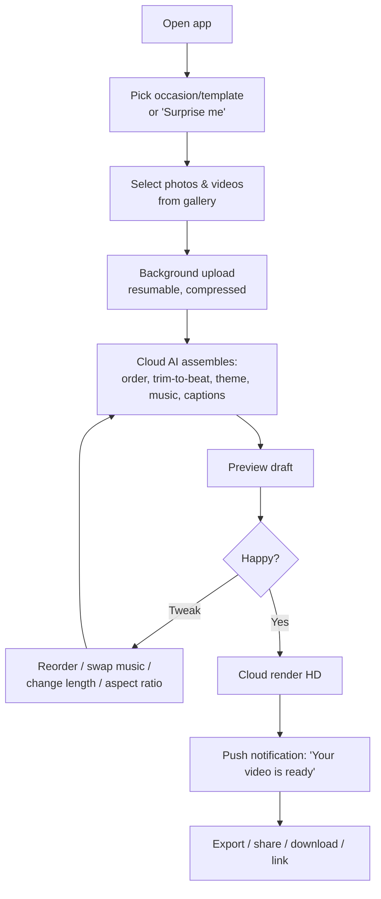
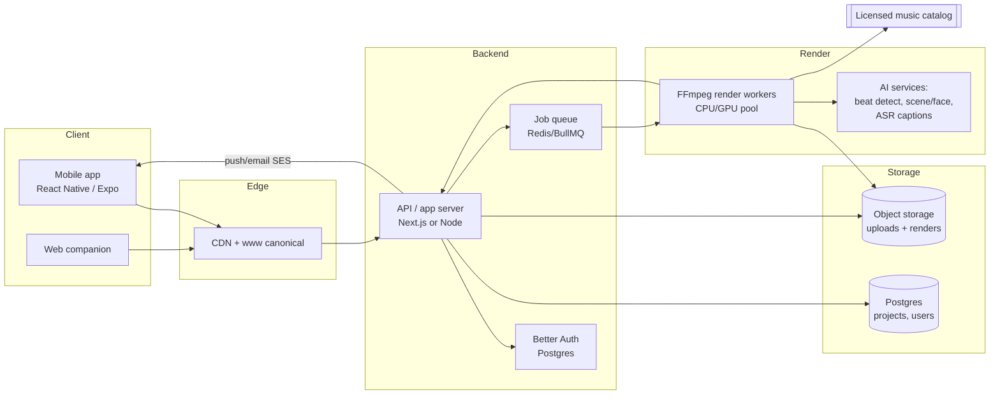

# VidNow *(working name — see Naming)* — Product Plan

> Turn the photos and videos already on your phone into a polished, music-driven
> highlight video in under a minute — without editing anything yourself.
>
> **Status:** concept / planning only. No code in this document. Provisional name used
> throughout is **VidNow**; final name TBD (see [Naming](#1-naming)).

---

## 1. Naming

You were circling `Vido.com`, `vidnow.com`, `vidier.com`, and the repo is `VidMine`.
Here's the honest read plus fresh options.

**Recommendation:** lead with a name that describes the *output* (a "reel") or the
*feeling* (memories + music), because "Vid-" names are generic and hard to own in search
and trademark.

| Name | Why it works | Watch-outs |
|------|-------------|------------|
| **Reelay** | reel + replay/relay; on-trend ("Reels"), describes the output, brandable | `.com` likely taken → `.ai`/`getreelay.com` |
| **Vibeo** | vibe + video → music *is* the vibe; short, memorable | reads as a "video" typo to some |
| **VidNow** *(your pick)* | clear, action-oriented, easy to say | very generic; SEO/trademark crowded |
| **Montagely** | literally what it makes | longer, a bit soft |
| **Kapsule / Kaptio** | "capture your moments in a capsule" | less literal |
| **Moovi** | movie + move; playful | spelling confusion |

**On your three domains:** four-letter and dictionary-ish `.com`s (`vido.com`) are almost
always registered or priced as premium, and `vidnow.com` is likely taken. I have **not
verified** these — I won't guess availability. Say the word and I'll run live
domain + trademark (USPTO) checks and hand you a clean shortlist with what's actually open.

**Standing-rule note:** whatever we pick, canonical host is `https://www.<domain>` with the
apex 308-redirecting to `www` (per your global rule).

---

## 2. The idea, sharpened

**Core loop:** open app → pick a vibe/template → select photos & videos from the gallery →
they upload in the background → **the cloud auto-edits them into a music video** → preview,
nudge a few things → export to TikTok/Instagram/YouTube or download.

**Who it's for (start narrow, expand later):**
- **Beachhead:** *travel & event recap creators* — people who just got back from a trip,
  wedding, birthday, or concert and have 200 photos/clips they'll never manually edit.
- **Expansion wedges:** real-estate agents (listing walk-throughs), small-business product
  promos, coaches/creators, sports parents, realtors.

**Why now:** phones shoot 4K, everyone posts vertical video, and AI auto-editing (beat
detection, scene selection, auto-captions) is finally good enough to make a *watchable*
cut without a human editor. The remaining pain is that good editing apps are still *work*.

---

## 3. What makes it more than "another slideshow app"

The market is full of on-device slideshow makers (CapCut templates, Google/Apple Memories,
VivaVideo, etc.). Differentiation, in priority order:

1. **Cloud rendering (the moat + the SaaS).** Heavy stitching/transcoding happens on our
   servers, not the phone. Enables long videos, 4K, complex effects, and consistent results
   on cheap Android phones. This is also what justifies a subscription.
2. **True AI auto-edit, not just a slideshow.** Beat-synced cuts, scene/face-aware
   selection ("pick the 30 best shots"), auto-trim shaky/blurry clips, auto-captions.
3. **Occasion templates with taste.** Trip, Wedding, Birthday, "Year in Review," Product
   Promo, Real-Estate Listing — each with curated pacing, transitions, and music mood.
4. **Licensed music that's actually safe to post.** The #1 reason auto-videos get muted or
   taken down. A cleared library (and clear rules for user-supplied audio) is a real feature.
5. **One source → every format.** Render 9:16, 1:1, and 16:9 from the same project.
6. **Later: collaborative event reels.** Multiple guests contribute clips to one shared
   wedding/party video — a genuine wedge nobody owns well.

---

## 4. Core user flow

Key UX principles:
- **Show the magic within ~30–60s** of selection, even if it's a draft-quality preview.
- **Uploads are the friction point** — do them in the background, resumable, with on-device
  compression so a 2-min 4K clip doesn't kill a cellular plan.
- **Rendering is async** — the user shouldn't stare at a spinner; notify when done.

---

## 5. Feature set — MVP vs later

**MVP (prove the magic + the economics):**
- iOS + Android gallery picker (photos + videos)
- 1–2 templates, one aspect ratio (9:16), a small fixed licensed-music set
- Background resumable upload + on-device compression
- Cloud auto-assemble (beat-synced cuts) + cloud HD render
- Preview, reorder, swap music, set length
- Watermarked free export; share sheet + download
- Accounts + one paid tier (remove watermark, HD, more length)

**v1.1:**
- More templates + music moods; multiple aspect ratios from one project
- Auto-captions (speech-to-text) and text overlays
- Face/scene-aware smart selection ("best 30")
- Web upload companion (drag a folder from a laptop)

**v2:**
- Collaborative shared albums → group event reel
- Brand kit (logo/colors/fonts) for prosumer/business tier
- Stock B-roll + AI transitions
- API / partner integrations (e.g., real-estate CRMs)

---

## 6. System architecture *(design only)*

Aligns with your standing stack (Better Auth, SES, AI Box, self-host-first).

**Component notes:**
- **Mobile:** React Native / Expo for one codebase (revisit native if camera-roll perf or
  on-device transcode demands it). Native modules likely needed for background resumable
  upload + compression.
- **Uploads:** direct-to-object-storage with presigned URLs; resumable (tus or multipart);
  client-side transcode/downscale before upload to cut bandwidth and storage.
- **Render pipeline:** queue + pool of **FFmpeg** workers. Autoscale on queue depth. GPU
  workers only if effects/4K throughput demands it (big cost lever — measure first).
- **AI services:** beat detection and scene/face selection can run on workers; captions via
  an ASR model. Some of this can run on your **AI Box** (Ollama/on-LAN) to cut cost for
  batchable work; keep a cloud fallback. Anything needing frontier quality → cloud.
- **Auth:** **Better Auth** on Postgres (your default) — email/social login, sessions.
- **Email:** **Amazon SES** via nodemailer (your default) for receipts, "video ready," etc.
- **Delivery:** finished videos served from object storage via CDN.

---

## 7. The hard parts (where this succeeds or dies)

1. **Render-cost economics.** Every render burns CPU/GPU-seconds + storage + egress. This
   sets your pricing floor. **Action:** build a cost-per-render model *before* pricing.
2. **Upload friction.** Videos are huge; mobile uploads fail. Background + resumable +
   client-side compression is not optional — it's the make-or-break UX.
3. **Music licensing = the legal landmine.** You cannot let users paste in Taylor Swift and
   post to TikTok safely. Options: (a) license a royalty-free catalog, (b) partner with a
   music-licensing API, (c) user-supplied audio with clear "you're responsible" terms.
   **Decide before launch.**
4. **App Store / Play IAP tax.** Apple and Google generally require in-app purchase for
   digital subscriptions and take **15–30%**. This directly hits margins and may push you
   toward web-based signup for subscriptions where policy allows. Factor into pricing.
5. **Storage growth.** Users upload gigabytes. Set retention (auto-delete source files after
   N days unless saved to a paid "project vault").
6. **Time-to-magic.** If the first preview takes 5 minutes, users churn. Draft-quality fast
   preview, full-quality async render.

---

## 8. Monetization

**Model:** freemium subscription + optional credit packs for one-offs.

| Tier | Price (sketch) | What you get |
|------|----------------|--------------|
| **Free** | $0 | Watermark, up to ~30s, 720p, limited music, source auto-deleted fast |
| **Plus** | ~$7–10/mo | No watermark, up to ~3 min, 1080p, full music library, all aspect ratios |
| **Pro / Business** | ~$20–30/mo | 4K, brand kit/logo, longer videos, priority render, project vault |
| **Credits** | pay-as-you-go | For non-subscribers who need one video now |

Pricing must be back-solved from cost-per-render (see §7.1). **Billing decision is
deferred to you** — for a *consumer subscription app* weigh a Merchant-of-Record
(Paddle/Polar) vs a direct processor, and account for App Store/Play IAP. Per your standing
rule, this is a "stop and present options" decision, not one I'll make unilaterally.

---

## 9. Go-to-market wedge

Don't launch "for everyone." Pick **one** painfully-specific audience and own it:

- **Option A — Travel recap reels:** target people right after a trip; hook = "drop your
  trip photos, get a ready-to-post reel." Huge volume, high shareability = organic growth.
- **Option B — Real-estate listing videos:** agents pay, need it weekly, tolerate a $30/mo
  price, easy to reach. Higher ARPU, less viral.

**Recommendation:** start consumer (A) for viral growth and volume, but keep the template
system generic enough that (B) is a fast follow once unit economics are proven.

---

## 10. MVP scope — the thin slice to build first

Goal: prove **(1)** people love the auto-edit and **(2)** the render economics work.

- One platform first if needed (iOS *or* Android), one aspect ratio (9:16)
- One or two templates, ~10 licensed tracks
- Gallery pick → background upload → cloud auto-assemble → preview → cloud HD render →
  watermarked share
- One paid tier (remove watermark + HD)
- Instrument everything: render time, render cost, upload success rate, time-to-first-preview,
  free→paid conversion

Explicitly **out** of MVP: collaboration, captions, 4K, web app, brand kits, multi-format.

---

## 11. Rough 90-day roadmap

| Phase | ~Weeks | Focus |
|-------|--------|-------|
| **0 — Validate** | 1–2 | Cost-per-render spike (FFmpeg on a worker), music-licensing decision, name + domain + trademark, landing page to gauge demand |
| **1 — MVP build** | 3–9 | Mobile picker + upload, render pipeline, auto-assemble, preview, one paid tier |
| **2 — Beta & iterate** | 10–13 | Closed beta with the beachhead audience, measure conversion + cost, tune templates/pacing |

---

## 12. Open decisions I need from you

1. **Name + domain** — pick a direction; want me to run live domain/trademark checks?
2. **Beachhead audience** — consumer travel/events (A) or real-estate/business (B)?
3. **Platform** — cross-platform (Expo) vs native-first, and iOS or Android first?
4. **Music strategy** — licensed catalog, licensing API, or user-supplied-only at launch?
5. **Billing model** — MoR vs direct processor, and how to handle App Store IAP.

---

*Planning document only — nothing built. Next natural steps: (a) live domain/trademark
check, (b) visual wireframes/mockups of the core flow, (c) a cost-per-render model to anchor
pricing.*
